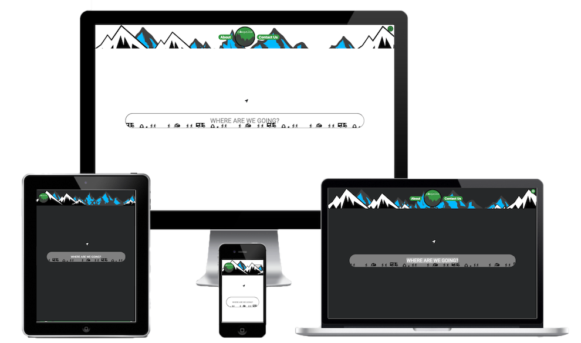

# Milestone-Project-2

## 

## Project

The purpose of the site will be to allow users to search for campsites/hotels around their searched area, or their location. The site will return the results within a set radius that can be adjusted. 
Users will be able to view information on each result givena and see the location on a map.

# Showcase

A deployed link to the site can be found [here](https://cod182.github.io/Milestone-Project-2/)

# UX

## User Story

The end user is someone who is looking for a campsite to stay at, near a specific location. The site will be aimed at the anyone looking to travel within the UK. The site will mainly be accessed on mobile/tablet devices due to ease of access whilst travelling but will also be disgned for desktop.

The end user will want to be able to find their nearest campsite quickly, see where it is on a map and get as much information on it. All information will need to be clearly displayed and easy to read.

## Strategy

### User Needs
- The user needs the site to be accessible mainly on mobile device but equally on tablets and desktops.
- Information must be easy to access, clearly displayed and easy to digest. Font to be used is Roboto and colours will be white and green
- Easily understand how the site works with a simple search bar and easy to find information
- Be able to search for a location and have all campsites in the area displayed
- Be able to click on a campsite to receive more information about the site (Services, location, opening times, website)

### Technical Capabilities

It is possible to create this site efficiently using the bootstrap framework and HTML/CSS/Javascript that I have learned.
Api will also be used for getting maps, searche results and weather information

### Business Vision

- The business vision is to help people locate an appropriate campsite to book when looking either during or before their travels.
- Simplicit and speed at the forefront so the user is not delayed in their search.

## Scope

- The site will include an about section detailing what the site does and what a user can gain from it.
- It will be easy to enact a search and read the results.

## Structure

- The site will be simply laid out and minimalistic, only covering one page.
- Extra information will be displayed in modals when a user clicks on the relevant link.
- The dynamic will be a map and a search reults section.
- Extra informatino from search results will be displayed in a modal.
- The page will flow as follows: Navigation bar, greeting search input, about section.
- Once a search is run, the greeting seach input will shrink and move higher up the page being replace with a full width map. A search results section will then display below the map and the about section below that.
- The extra information on the search reults will be displayed in a modal when clicked on.

## Skeleton

### Wireframes

Wireframes were created at the start of the project using balsamiq. These were updated during the project as the design was altered and features were added.

## Original

- [Mobile >576px](assets/images/readme/wireframes/_576px.png)
- [Mobile >576px](assets/images/readme/wireframes/_576px.png) 
- [Tablet ≥768px](assets/images/readme/wireframes/≥616.png)
- [Desktop ≥992px](assets/images/readme/wireframes/≥992px.png)
- [Desktop ≥1400px](assets/images/readme/wireframes/≥1440px.png)

## Re-design

- [Mobile >576px](assets/images/readme/wireframes/redesign/_576px.png)
- [Tablet ≥768px](assets/images/readme/wireframes/redesign/≥768px.png)
- [Desktop ≥992px](assets/images/readme/wireframes/redesign/≥992px.png)
- [Desktop ≥1400px](assets/images/readme/wireframes/redesign/≥1440px.png)

## Surface

The site will be a single page with dynamic content containing a map, searched results and weather information

### Home

The user will be presented with a navagation bar and a search box greeting on initial load. Futher down the page will be an about section.
Once a user enacts a search, the search box will shrink and move to the top of the page with a full width map replacing it, showing relevant map location.
Below the map a search results section will appear, giving information on each of the results shown on the map with the current weather.
When the result title is clicked, the map will focus on the result.
When the more info button is pressed on a result, the result will expand revealing more information
When a mark result marker is click, a pop up will appear giving some information.

## Visual Design
	
The colour scheme of the site will be bright with splashes of colour matching a wild/nature theme.

The fonts to be user are roboto

## Features

### Existing Features

- Searching for results based on a area/city/postcode
- Searching for results based on geolocation
- set the radius of the results from 5 - 50 miles
- View the Current/Hourly/Daily weather for each result
- Contact website own via a contact panel

### Features to be implemented

- Diirections to the selected result
- Book the campsite/hotel through the result area
- Save favourite places

## Technoogies used

- HTML5
- CSS
- Javascript
- Here Maps API
- OpenWeather API
- EmailJS API
- Font Awesome CDN

# Testing

## Planning

At the beginning of the project I was aware of the audience for the website and their needs when visiting. I considered the devices that would be used when visiting and took note of ensuring the pages looked their best when visited. I also considered the path they would taken while using teh site.

The devices I plan to test the websit with are:

Chrome Developer Tools

iPhone 5/SE (320x568)
iPhone 6/7/8 (357x667)
iPhone 6/7/8 Plus (414x736)
iPad (768x1024)
iPad Pro (1024x1366)
Handheld Device Realworld Testing

iPhone XS Max
iPhone 12
iPad Pro 11"
Samsung Galaxy A40
Screen Testing

Laptop Screen 13" (1280x800)
Safari
Chrome
Laptop Screen 16" (3072x1920)
Safari
Chrome
Desktop Screen 22" (1680 × 1050)
Safari
Chrome
iMac 5K Screen 27" (5120x2880)
Safari
Chrome

The sequence I used for testing the user path of the site:

1. Load site
2. Click dark mode button
3. scroll to about section to read
4. Enter a search term
5. Click on a random result title to focus map
6. Click on the map marker for more information
7. Go to result and click on more information
8. toggle the Hourly/Daily weather
9. Repeat 5-8 on a different result
10. Click the geolocation search button
11. Repeat 5-8 on a result
12. Click Coontact Us Nav buton and send a message

## Running Tests

During the testing processed I used Chrome Developed tools whenever an issue was discovered. This ensured the issues could be resolved before editing my html files. Validators were used to pick up any issues with the code, where a problem was discovered, it was resolved and re-tested until no issues were discovered. Google Lighthouse was then used to check the Perormance, Accesability, Best Practices and SEO levels. When issues were discovered that we causing scores to drop, html & css was edited in Chrome Developer Tools to ensure the resoltion worked, then commited in my html files. This was repeated until scores were at an accepable level.

### HTML5 
The code was validated using [W3C Markup Validation Service](https://validator.w3.org/#validate_by_input)
- index.html passed
- 404.html passed
### CSS3 
The code was validated using [W3C CSS Validation Service](https://jigsaw.w3.org/css-validator/#validate_by_input)

- styles.css passed

## Testing Results

### Bugs that occured

- Bug: When the screen size switched to medium, the geolocation button would be behind the map container when a search happened.
    - Solution: Added a media query to move the button when the screen size went below 992px

## Deployment

The project is hosted in GitHub and built in GitPod.

The desployed site is hosted on GitHub Pages and can be viewd here : https://cod182.github.io/Milestone-Project-2/
This was executed by:
- Go to https://github.com/cod182
- Got to the Milestone-project-2 Repo
- Clicking on Settings
- Clicking on Pages
- Selecting master from sources
- Clicking save

The site was the made avaiable at the above url.

 To clone the project:

- Go [Here](https://github.com/cod182/Milestone-Project-2)
- Click Code
- Choose either
    - Open with GitHub Desktop
    - Download as Zip
- You can now open the project in a IDE or host to a server

## Bugs/Changes During Development

# Credits

- Help with localStorage provided by Kevin Powell on YouTube
- CSS loading provided by [crazyegg.com](https://www.crazyegg.com/blog/loading-spinners-css3-animation/)
- No results found image from [clipartmax](https://www.clipartmax.com/middle/m2i8d3N4d3b1K9b1_sorry-no-results-found/)
- error image from [clipartmax](https://www.clipartmax.com/download/m2i8K9b1N4H7d3G6_big-image-road-sign-no-entry/)
- General help found on W3School.com
- Alert boxes powered by sweetalert
- HereMaps used for mapping a searching
- OpenWeatherApi used for weather results
---
## This project is for educational purposes only

### Created by Codie Stephens-Evans