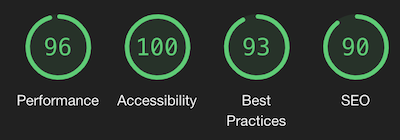
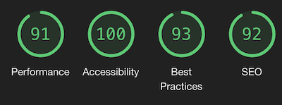

# Testing for Milestron Project 2 - CampZilla

## Chrome Developer Tools - Lighthouse
- Home Page - Desktop

- Home Page - Mobile

## Testing Process - User

1. Load site
2. Click dark mode button
3. scroll to about section to read
4. Enter a search term
5. Click on a random result title to focus map
6. Click on the map marker for more information
7. Go to result and click on more information
8. Toggle the Hourly/Daily weather(Desktop Only)
9. Repeat 5-8 on a different result
10. Click the geolocation search button
11. Repeat 5-8 on a result
12. Click Coontact Us Nav buton and send a message

## Chrome Developer Tools
### iPhone 5/SE 320x568 & 568x320

- Bug: Website address going off page due to long address.
    - Solution: added word-wrap:breakwork to class of website address

### iPhone 6/7/8 357x667 & 667x357

### iPhone 6/7/8 Plus 414x736 & 736x414

### iPad 768x1024 & 1024x768

### iPad Pro 1024x1336 1336x1024

## Handheld Device Realworld Testing - Testing Log
### iPhone XS Max

### iPhone 12 Pro

### iPad Pro 11

### Samsung A40

## Screen Testing - Testing Log
### Laptop 13" Screen 1280x800

### Laptop 16" Screen 3072x1920

### Desktop 22" Screen 1680x1050

### iMac 5k 27" Screen 5120x2880

